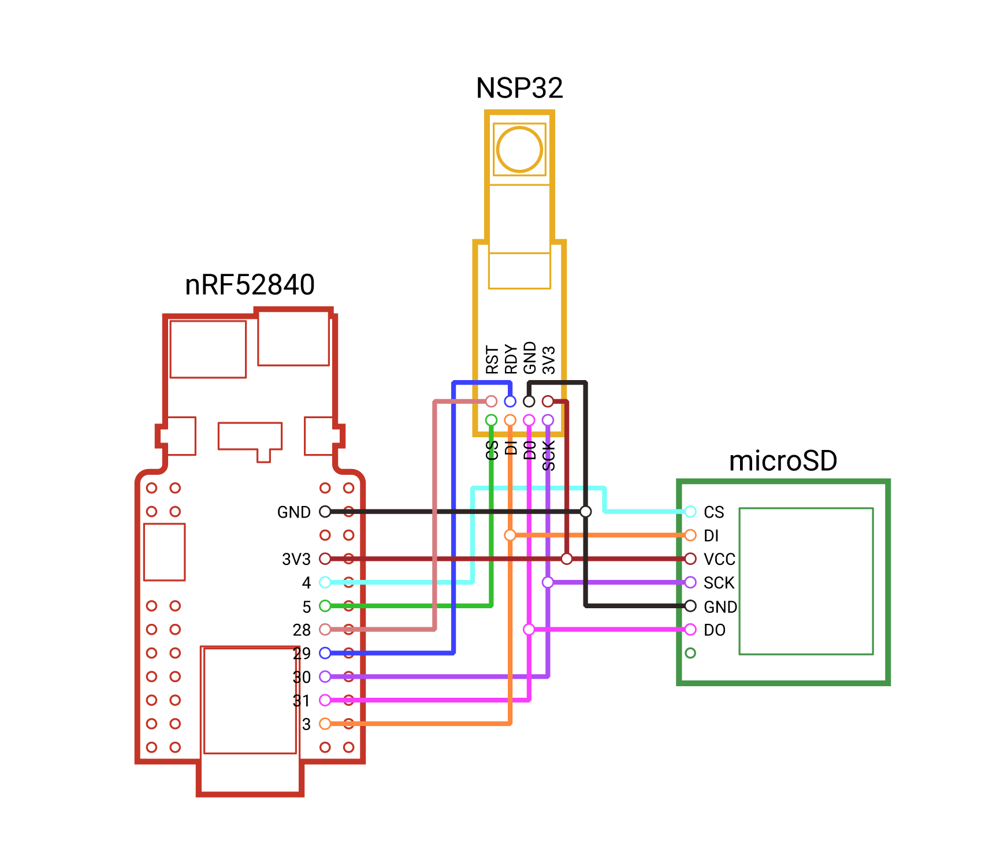

# Open Spectral Sensing

## Table of Contents
1. [About the Project](#about-the-project)
1. [Overview](#overview)
1. [Getting Started](#getting-started)
1. [Capturing Data](#capturing-data)
1. [Build Guide](#build-guide)
1. [Calibration](#calibration)
1. [Troubleshooting](#troubleshooting)
1. [References](#references)
1. [Credits](#credits)

<h2 id="about-the-project">About the Project</h2>
Visible light is made up of several individual wavelengths, each with their own power level. By measuring the power distribution of light throughout the spectrum, we can begin to identify light and quantify its qualities. A spectral sensor measures the power levels at each wavelength. This data can be used for various use-cases such as in color calibration, agriculture, health, and more. 

<h2 id="overview">Overview</h2>
The sensor is programmed using Arduino (C++) and communicates via a Python program. The sensor consists of off-the-shelf components from Sparkfun, and a spectral sensor from nanoLambda - producing an easy-to-assemble spectral sensing device. The goal of this project is to create an open-source and affordable spectral sensing device in order to make light research more accessible.

<h2 id="getting-started">Getting Started</h2>

For wiring, and assembly instructions, see the [Build Guide](#build-guide).

<h3>Installation</h3>


- You must first install the firmware onto the device using provided [compiled binaries]() by following the instrucions below:
    
    - Connect the sensor to a computer via USB
    - With the sensor powered on, double tap the RESET button on the side. (If the sensor is enclosed in the case, you can use an M2 allen-key through the provided hole on the side of the case). This will bring up the "NRF52BOOT" sensor folder.
    - Drag and drop the compiled binary ("firmware_xxxx.uf2") file into this new folder. The sensor will automatically disconnect and update the firmware.
    - Disconnect and reconnect the sensor.

- To connect to the sensor using ```dock.py```, first install matplotlib and pySerial.
```
$ pip install matplotlib
$ pip install pyserial
```

- (Optional) To build your own firmware using the provided source, you must install Arduino IDE and the following libraries:

    - Install Arduino IDE: https://www.arduino.cc/en/software
    - NSP32-Library: https://github.com/arsalan1322/NSP32-Library
    - Installing the Arduino Core for nRF52 Boards: https://learn.sparkfun.com/tutorials/nrf52840-development-with-arduino-and-circuitpython
    - Time library: https://github.com/PaulStoffregen/Time


<h3>Usage</h3>

Once you have assembled the sensor, and flashed the firmware, and installed the required Python packages, you can connect to it using the ```dock.py``` program.
```
$ python dock.py
```
The program will begin looking for a connected spectral sensor, connect to it, then display the menu below. From this menu, you can see the sensor name, sensor port, the current status of the sensor, as well as the current recording interval in ms. You can also start a manual recording, or change other sensor settings. 

```
Time has been set successfully to 20221005165331
---
Selected device: NSPS on port: COM20.
Currently PAUSED. Recording interval is set to 15000
---
[1] START_RECORDING
[2] MANUAL_CAPTURE
[3] EXPORT_ALL (0 entries)
[4] RESET_DEVICE
[5] SET_COLLECTION_INTERVAL
[6] SET_DEVICE_NAME
[7] SET_CALIBRATION_FACTOR
[8] DISCONNECT
[9] CONFIGURE_NSP
[10] REFRESH
Choose a command by entering the number in front
>
```
From here, you can enter ```9``` to enter ```CONFIGURE_NSP``` which will guide you through setting up the sensor for quickly capturing data. 

Alternatively, you can set the recording interval by entering ```5```, then start the recording by entering ```1```. Then, you can disconnect the device by entering ```8```. This step does not set the device name, and uses default capture settings.

At this point, you can disconnect the USB cable if the device is already connected to the battery. The device will continue to collect data according to the interval you set. 

<i>Note that if the device powers off somehow due to a disconnected battery or lack of charge, it will stop recording until started again through</i> ```dock.py```.

<h4>Reading Data </h4>

Enter ```3``` to export all data stored on the device onto the conneced computer. Look for a "data" folder in the same directory as ```dock.py```. 

For large files that contain over 500 datapoints, it is recommended to read data directly off the microSD by ejecting it from the sensor. The microSD can be accessed by removing the cap only.

<h4>Data Structure</h4>

Data is stored on the sensor in a CSV format. There are 146 columns. Columns 1 - 11 hold information about the spectral measurement, and columns 12 - 146 hold the spectral power distribution at 5 nm intervals from 340 nm to 1010 nm. Each row is a unique captured datapoint.

| Column # | Column title | Example data | Range    | Description                                                                                                       |
|----------|--------------|--------------|----------|-------------------------------------------------------------------------------------------------------------------|
| 1        | DATE         | 05/10/2022   | -        | The date on which this datapoint was captured. |
| 2        | TIME         | 12:30:37     | -        | The time on which this datapoint was captured. |
| 3        | MANUAL       | 1            | 0 or 1   | Was this datapoint captured manually? 1 if yes, 0 if no. |
| 4        | INT_TIME     | 448          | 1 - 1000 | The integration time used for this datapoint. Exposure time (ms) = (896*[IntegrationTime] + 160) / 500 |
| 5        | FRAME_AVG    | 3            | 1 - 10   | How many frames where averaged for this datapoint. |
| 6        | AE           | 1            | 0 or 1   | Was autoexposure enabled? 1 fi yes, 0 if no. |
| 7        | IS_SATURATED | 0            | 0 or 1   | Was this recording captured under too bright of a condition? 1 if yes, 0 if no. A saturated recording should not be used. |
| 8        | IS_DARK      | 0            | 0 or 1   | Was this recording captured under too dark of a condition? 1 if yes, 0 if no. A dark recording should not be used. |
| 9        | X            | 38.61        | -        | CIE1931 X value. |
| 10       | Y            | 37.52        | -        | CIE1931 Y value. |
| 11       | Z            | 21.73        | -        | CIE1931 Z value. |
| 12 - 146       | 340 - 1010            |  -       | -        | spectral power in W/m<sup>2</sup>. |

<h4>Charging</h4>

The device will automatically turn off when the battery voltage is too low. Simply plug the sensor into a computer via USB to begin charging. See [LEDs](#leds) for charging indicator.

<h4 id="leds">LEDs</h4>

The sensor has three on-board LEDs: red, blue, and orange. The red LED is always on when the sensor is powered on. The orange LED is only on when the battery is charging, off when charge complete or battery is not connected. 

The blue LED behaviour can be classified using the following list:

- Solid on when sensor has not been setup and it is not recording.
- On for a brief moment while sensor is collecting data, off otherwise.
- Flashes to indicate a problem. See [Troubleshooting](#troubleshooting).

<h2 id="capturing-data">Capturing Data</h2>

There are three ways to capture data using the sensor.

<h3>Automatic</h3>

Automatic capture is when you plug in the device, and start recording via the ```START_RECORDING``` menu option in ```dock.py```. The recording interval must be set. Recording will last until stopped via the dock program, or if power is lost.

<h3>Automatic timed start and stop</h3>

This mode is for creating a start and end time for datapoint capture. You can schedule a recording to start, and/or end. 

<h3>Manual capture</h3>

With the device plugged in and connected to the dock program, you can initiate a datapoint capture by selecting ```[2] MANUAL_CAPTURE```. A recording interval does not need to be set for this mode. The device will capture one measurement and save it to device memory.

With this feature, you can also preview a graph of the datapoint once captured. 

<h2 id="build-guide">Build Guide</h2>

<h3>Parts List</h3>

Electronics

1. [nanoLambda NSP32m W1](https://nanolambda.myshopify.com/products/nsp32m_w1_temp)
2. [SparkFun Pro nRF52840 Mini](https://www.sparkfun.com/products/15025)
3. [SparkFun microSD Transflash Breakout](https://www.sparkfun.com/products/544)
4. 2GB+ microSD card
5. [800mAh Li-Po battery with 2mm JST connector](https://www.solarbotics.com/product/17804)
6. [30 AWG Silicone Wire](https://www.amazon.ca/gp/product/B01M70EDCW/ref=ppx_yo_dt_b_asin_title_o04_s00?ie=UTF8&psc=1)

Hardware (optional)

6. [3D printed case ]() (Found in ```3D Models\Case```)
7. 2x M2 bolts and 2x nuts (for cap)

<h3 id="wiring-diagram">Wiring Diagram</h3>



<h3 id="layout">Layout</h3>


<h3>Soldering</h3>

To allow for a small device footprint, flexible 30 AWG silicone wire is used. Approximately x cm of wire is used for the configuration outlined in [Layout](#layout)

Soldering happens from both the top and bottom of the nRF52840. "Helping hands" are highly recommended, as well as a fine-tip soldering iron.

Use the following table to help cut, match, and solder wires:

| Wire  # | Length (cm) | Pin on nRF52840 | Pin on microSD card reader | Pin on nanoLambda NSP32m |
|---------|-------------|-----------------|----------------------------|--------------------------|
| 1       |             | GND             | GND                        | GND                      |
| 2       |             | 3V3             | VCC                        | 3V3                      |
| 3       |             | 4               | CS                         | -                        |
| 4       |             | 5               | -                          | CS                       |
| 5       |             | 28              | -                          | RST                      |
| 6       |             | 29              | -                          | RDY                      |
| 7       |             | 30              | SCK                        | SCK                      |
| 8       |             | 31              | DO/MISO                    | DO/MISO                  |
| 9       |             | 3               | DI/MOSI                    | DI/MOSI                  |

Wires for the microSD card reader are soldered from the bottom, wires for the NSP32m are soldered from the top.
Two wires connect to single common pins on the nRF52840 for GND, 3V3, SCK, DO, and DI.

<h3>3D Printing</h3>

The case consists of three separate parts that come together to enclose the sensor. They are locatetd in the ```3D Models\Case``` directory.


<h4>Material</h4>
PETG (recommended), PLA, ABS, etc. Recommended material is PETG due to its flexibiliy. PLA and ABS can be used, but repeated strain may cause parts to snap.

<h4>Layer height</h4>
0.12 mm or finer.

<h4>Supports</h4>
Yes, as shown in orange.

<h4>Part orientation</h4>

**If using FDM printer, the part orientation is important for maximum strentgh.**


<h3>Assembly</h3>

1. Insert the NSP32m sensor through the hole in the ```top``` part of the case
2. Slide in the nRF52840 while gently pushing down the NSP32m, ensuring the microSD reader slides in to its slot when the nRF52840 is half-way inserted.
3. Slide the battery into the ```bottom``` part of the case as shown. The cable will come around to the front through the channel on the side.
4. Snap together both the ```bottom``` and ```top``` parts of the case, making sure the silicone wires are out of the way.
5. Fit two M2 hex bolts into the ```cap```. They are compression fit.
6. **Before installing the ```cap```, make sure to program the sensor, as the USB port is inaccessible with the ```cap``` on.**
6. *Once the sensor has been programmed*, slide the ```cap``` onto the case, lining up the forks on the sides.
7. Screw in two M2x8mm bolts through the forks. 
8. (optional) Insert lanyard loop.

*The sensor is not waterproof, please keep it dry.*


<h2 id="calibration">Calibration</h2>

...

<h2 id="troubleshooting">Troubleshooting</h2>

<h3>Blue LED flashes once: Problem with SD card.</h3>

1. Check if SD card is inserted
2. Plug in SD card to computer and delete all files stored on it

<h3>Blue LED flashes twice: Problem with internal memory</h3>

1. Connect the sensor to ```dock.py```
2. Select ```RESET_DEVICE``` by entering ```4```

<i>If problems persist, </i>

<h2 id="references">References</h2>

1. nanoLambda
2. Arduino 
3. 

<h2 id="credits">Credits</h2>

...
